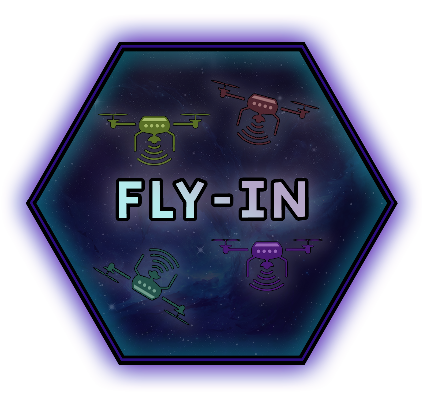

<p align="center">
  
</p>
<h3 align="center">
  <em>Drones are interesting.</em>
</h3>

---

<div align="center">
  
  
  
</div>

## ⚠️ Disclaimer

- **Full Portfolio:** This repository focuses on this specific project. You can find my entire 42 curriculum 👉 [here](https://github.com/Overtekk/42).
- **Subject Rules:** I strictly follow the rules regarding 42 subjects; I cannot share the PDFs, but I explain the concepts in this README.
- **Archive State:** The code is preserved exactly as it was during evaluation (graded state). I do not update it, so you can see my progress and mistakes from that time.
- **Academic Integrity:** I encourage you to try the project yourself first. Use this repo only as a reference, not for copy-pasting. Be patient, you will succeed.

---
## ✏️ Quick Start

```bash
make  # install all dependencies and run the script. It will show a menu with all maps available in the 'maps' folder

make run  # launch the script with the menu

make run M=<pathToMap>  # launch the script with a specific map
```
> [!NOTE]
> If you don't have `uv` installed, run `make install`

---
## 📂 Description

### 📜 Summary:

This project implements an efficient autonomous drone routing system. The objective is to navigate a fleet of drones from a central starting hub to a target end hub through a network of connected zones, completing the mission in the fewest possible simulation turns.

The pathfinding algorithm must dynamically handle several strict network constraints:
* **Zone Types & Movement Costs:** Zones can be `normal` (1 turn), `restricted` (2 turns), `priority` (1 turn), or `blocked` (inaccessible).
* **Occupancy Limits:** Both zones (`max_drones`) and connections (`max_link_capacity`) have maximum simultaneous drone capacities.
* **Collision Avoidance:** Drones move simultaneously but cannot enter a zone if it exceeds its capacity or conflicts with another drone's path.

**Technical Constraints:**
* The codebase must be 100% Object-Oriented (OOP).
* No external graph management libraries (like `networkx`) are allowed.
* The code must be strictly typed and pass `mypy` and `flake8` validations.
* The simulation includes a step-by-step visual representation (terminal colors or graphical interface) and a strictly formatted text output for each turn.

### 📝 Rules:

- Must be written in **Python >=3.10**.
- Must adhere to the **flake8** and **mypy** standard.
- Crash and leaks must be properly managed. All errors must be handled gracefully.
- Code must include type hints and docstrings *[(following PEP 257)](https://peps.python.org/pep-0257/)*
- Any library that helps for graph logic is forbidden (such as networkx, graphlib, etc.).
- Project must be completely **object-oriented**.

### 📮 Makefile:

This project must have a Makefile and the following rules:
- **install**: install project dependencies using **pip**, **uv** etc...
- **run**: execute the main script of the project.
- **debug**: run the main script in debug mode using Python's pdb.
- **clean**: Remove temporary files or caches.
- **lint**: execute the commands `flake8` . and `mypy . --warn-return-any
--warn-unused-ignores --ignore-missing-imports --disallow-untyped-defs
--check-untyped-defs`.
- **lint**: execute the commands `flake8 .` and `mypy . --strict`.

### 📋 File format:

*Example*:

```bash
nb_drones: 5

start_hub: hub 0 0 [color=green]
end_hub: goal 10 10 [color=yellow]
hub: roof1 3 4 [zone=restricted color=red]
hub: roof2 6 2 [zone=normal color=blue]
hub: corridorA 4 3 [zone=priority color=green max_drones=2]
hub: tunnelB 7 4 [zone=normal color=red]
hub: obstacleX 5 5 [zone=blocked color=gray]
connection: hub-roof1
connection: hub-corridorA
connection: roof1-roof2
connection: roof2-goal
connection: corridorA-tunnelB [max_link_capacity=2]
connection: tunnelB-goal
```

### Mandatory key:

|Prefixe|Value|Definition|
|:-----:|:---:|:--------:|
|`nb_drones`|\<number>|Defines the number of drones|
|`start_hub`|\<name> \<x> \<y> [metadata]|Marks the starting zone|
|`end_hub`|\<name> \<x> \<y> [metadata]|Marks the end zone|
|`hub`|\<name> \<x> \<y> [metadata]|Defines a regular zone|

### Metadata tags:
|Prefixe|Value|Definition|
|:-----:|:---:|:--------:|
|zone=\<type>|default: normal|Define a zone type|
|color=\<value>|default: none|Define a color for the zone|
|max_drones=\<number>|default: 1|aximum drones that can occupy this zone simultaneously|

### Zone types:
|Value|Definition|
|:---:|:--------:|
|normal|Standard zone with 1 turn movement cost (default)|
|blocked|Inaccessible zone. Drones must not enter or pass through this zone. **Any path using it is invalid**|
|restricted|A sensitive or dangerous zone. Movement to this zone costs 2 turns|
|priority|A preferred zone. Movement to this zone costs 1 turn but should be prioritized in pathfinding|

### Colors:
- Colors are optional and can be used for visual representation (terminal output
or graphical display).
- Accepted values for color are any valid single-word strings (e.g., red, blue,
gray). There is no fixed list of allowed colors.

### Connections:
|Prefixe|Value|Definition|
|:-----:|:---:|:--------:|
|connection|\<name1>-\<name2> [metadata]|- Define a bidirectional connection (edge) between two zones. The connection syntax forbids dashes in zone names|

Optional metadata:
|Prefixe|Value|Definition|
|:-----:|:---:|:--------:|
|max_link_capacity=\<number>|default: 1|Maximum drones that can traverse this connection simultaneously|

- The first line must define the number of drones and must be positive integers.
- Start end and zone must be unique.
- A connection between entry and exit must exist.
- Each zone must have a unique name and have positive integers.
- Connections must link only previously defined zones using connections. The same connection must not appear more than once.
- Comments start with a `#` and are ignored.

---
## 💡 Instructions

### 1. Git clone this repository:
```bash
git clone https://github.com/Overtekk/Fly-in.git
```

> [!NOTE]
> If you don't have `uv` installed, run `make install`

### 2. Run:
#### Using the Makefile
```bash
make  # install all dependencies and run the script. It will show a menu with all maps available in the 'maps' folder

make run  # launch the script with the menu

make run M=<pathToMap>  # launch the script with a specific map
```
#### Using UV
```bash
uv run python -m src # launch the script with the menu

uv run python -m src <pathToMap>  # launch the script with a specific map
```

### You can specify custom arguments:
#### Using the Makefile *(only available for `debug` mode)*
```bash
make run-debug --debug # launch the script with the debug mode

make run-debug M=<pathToMap> --debug # launch the script with the debug mode with a specific map
```

|Argument|Description|
|:------:|:---------:|
|--debug| Debug mode intended to be use while developping. Show more informations on the screen|
|--show_logs | Show the log output directly in the terminal output|
|--show_more_logs| Show more logs informations (number of drones remaining, zone capacity) in the terminal output AND in the output file|

You can use those arguments like this:
`uv run python -m src <map> --show_logs`

---

## ⚙️ The Algorithm:

To navigate the drones efficiently, this project implements a **Reverse Dijkstra Algorithm**.

Standard pathfinding algorithms typically calculate the shortest route from point A to point B. However managing 1000 independent drones would require recalculating paths constantly, which is highly inefficient.
And I wanted to try to optimize this project.

So, instead, the algorithm starts from the End Hub and propagates outward to every other connected zone, calculating the lowest cumulative cost to reach the destination.

The cost to traverse a connection is not uniform. It accounts for the specific constraints of the zones (e.g., Normal, Priority, Restricted, or Blocked). A Blocked zone represents an impassable wall (ignored from the explorable graph), while a Restricted zone might impose movement delays.

This reverse calculation creates a comprehensive **"cost map"** *(or heatmap)*. Once generated, any drone, regardless of its current location, simply queries its neighbors and moves to the node with the lowest remaining cost to the exit. It transforms complex individual pathfinding into a simple, global flow.

While the algorithm dictates the ideal path, the Manager dictates the reality of the simulation. It acts as the central state machine and orchestrator.

Its primary responsibilities include:

- **Process the turn:** The Manager processes the environment turn by turn. It decides which drone is allowed to move and which must wait.

- **Constraint Enforcement:** It strictly applies the network's physical rules. If a zone has a max_drones capacity of 20, the Manager acts as a gatekeeper, blocking the 21st drone and forcing it to wait or reroute, overriding the algorithm's optimal path to prevent collisions.

- **Multi-Turn Resolution:** It handles complex transit states, such as drones taking multiple turns to cross Restricted zones, keeping track of their exact status between two discrete locations.

- **Data Synchronization:** It feeds the sanitized, turn-resolved data to the visual Renderer, ensuring the graphical interface (Arcade) strictly reflects the underlying logical truth.

---

## 🔋 Software Architecture (OOP)

The project follows a strict **Object-Oriented** hierarchy to ensure modularity and type safety:

- Parsing (`src/maps_parser/parser.py`): Parsing logic. Validate only a map, or the whole folders and give instructions if a map isn't valid.

- Simulation Manager (`src/simulation/manager.py`): Core of the program. Create all drones and zones. Call the algorithm. It orchestrates the clock, moves the drones each turns, and ensures that no rules are broken, that drones can move, where to go.

- Drone Agent (`src/object/drones.py`): Represents an individual unit. It tracks its own state (moving, waiting, finished, current location).

- Network Components:

    - Zones (`src/object/zone.py`): Nodes in our graph. They hold metadata like max_drones, zone type, drones on it and weight.

    - Connections: Edges between zones. They manage max_link_capacity.

- Renderer (`src/graphics/renderer.py`): Decoupled from the logic, it only consumes the state provided by the Manager to update the UI each turn.


#### The Parsing

The parser act as a gatekeeper. You can provides a specific map as an argument. In this case, only this map will be checked. In the other hand, if no arguments are provided, the all `maps` folder will be scanned. Each folder will be a category, and files will be checked. All of this gave a menu with maps selection and even a category to see which maps can't be use and why (to fix them!).

### Menu: choose your map, see errors
<p align="center">
  <video src="assets/menu.mp4" width="500" autoplay loop muted playsinline></video>
</p>

#### The Simulation Engine (Manager)

While the algorithm dictates the ideal path, the Manager enforces the reality:

- **Collision Avoidance**: If a zone reaches its `max_drones` capacity, the Manager acts as a gatekeeper. Drones are forced to wait or take a detour, even if their algorithm wants them to move forward.

- **Multi-Turn Resolution**: In a restricted zone, a drone is "busy" for 2 turns. The Manager handles this intermediate state, ensuring the drone is neither at the start nor the end of its move during the transition.

---
## 🖥️ Visual representation

The visual representation use the `Arcade` library. A powerfull library used to makes visual and games, providing a high-performance OpenGL-accelerated view of the simulation.

Once you launch the script, a window will appear with custom sprites.\
Use **SPACE** to start the simulation.

A window in the top left can be used to control the simulation:
- You can pause anytime you want (the use of the **SPACE** key also works)
- You can control the speed (the use of the **+** and **-** keys also works). Minimum is 100% (default), and maximum is 1000% speed
- You can close the program by using **ESCAPE** key or the cross of each windows
- You can move the window anywhere on the screen
- A progress bar will show the completion of the simulation (a drone that have finished will make the bar progress)
- Visual legend to know which icon is what.

<br>

The rendering is performed in **real-time**.
Why ? For two reasons:
- When I was building the algorithm and the manager, it was more easy for me to see whats goes wrong, what works.
- I feel like it's better to see in real-time what going on even if it's a bit more chaotic to code (like the progress bar is updated when a drone goes to the end_hub and not when its on it.)

<br>

Funny things can be done by clicking somewhere on the window. Find them!

🌟
<p align="center">
  <video src="assets/visual.mp4" width="800" autoplay loop muted playsinline></video>
</p>

---

### ✨ Optimization

I tried my best to optimize this program. The sprites are loaded once (also ensuring that the path exist), all the visual is well optimize (and I'm sure that it can be better).

For the algorithm, I tried to have something that launch once and then, drones and/or the manager will do the rest **(O(V²))**. In this case, everything works clean and it's not too heavy for the computer.

The code is a bit messy. I'm still learning and I need to works on other projects. I can rewrite everything in a better way but it not be efficient and other projects will be more readable. Sorry for that.

---

## 📚 Resources

### Documentations for Python built-in functions and libraries
| Resource | Description |
| :------: | :---------: |
| [Python docs ⎯ Regular expression operations (re)](https://docs.python.org/3/library/re.html) | Using the `re` syntax
| [Geeksforgeeks ⎯ Regular expression operations (re)](https://www.geeksforgeeks.org/python/re-match-in-python/) | Using the `re` syntax
| [Comment coder ⎯ Pattern matching](https://www.commentcoder.com/python-switch-case/) | Use `match` and `case` to avoid using blocks of `if/elif/else`
| [Python docs ⎯ Heapq](https://docs.python.org/3/library/heapq.html) | How to use heapq and how its works
| [Geeksforgeeks ⎯ Heapq](https://www.geeksforgeeks.org/python/heap-queue-or-heapq-in-python/) | How to use heapq and how its works |
| [Python docs ⎯ Argparse](https://docs.python.org/3/library/argparse.html) | How to use `argparse` |
| [Stackoverflow ⎯ Files permissions](https://stackoverflow.com/questions/1861836/checking-file-permissions-in-linux-with-python) | How to check files permissions |

### Documentation for the `Pydantic` library
| Resource | Description |
| :------: | :---------: |
|[Pydantic docs ⎯ Default values field](https://docs.pydantic.dev/latest/concepts/fields/#default-values) | Used to know how to have default value and a `default_factory` |

### Documentation for the `Arcade` and `Pygame` libraries
| Resource | Description |
| :------: | :---------: |
|[Officiel Arcade API docs](https://api.arcade.academy/en/stable/) | Learning how `arcade` works and how to implement it |
|[Arcade docs ⎯ Official documentations](https://arcade-pk.readthedocs.io/en/latest/) | Official documentations with a lot of examples (thanks for that!!) |
|[Pygame official docs](https://www.pygame.org/docs/) | Reference of how to use `pygame` |
|[Zestedesavoir ⎯ How to create a window](https://zestedesavoir.com/tutoriels/846/pygame-pour-les-zesteurs/1381_a-la-decouverte-de-pygame/creer-une-simple-fenetre-personnalisable/) | Tutorial of how to create a window of the basics of `pygame` |
|[Zestedesavoir ⎯ Show sprite on screen](https://zestedesavoir.com/tutoriels/846/pygame-pour-les-zesteurs/1381_a-la-decouverte-de-pygame/5505_afficher-des-images/) | Tutorial of how to use custom sprite |
|[Zestedesavoir ⎯ How to use custom font](https://medium.com/@amit25173/pygame-fonts-guide-for-beginners-e2ec8bf7671c) | Tutorial of how to use custom font |

> [!NOTE]
> I first use pygame as the rendering library but switch to `arcade` because I like it more. I discovered using by doing a personnal project and thought that `arcade` was more easy to learn and implement. I figured it that it was also more optimized in term of memory usage and ram. Of course, `arcade` have like almost no documentations.

### Documentation used to create the algorithms
| Resource | Description |
| :------: | :---------: |
|[Wikipedia ⎯ Dijkstra algorithm](https://fr.wikipedia.org/wiki/Algorithme_de_Dijkstra) | Learn what is this algorithm, how it works and its story|
|[Datacamp ⎯ Implementation of Dijkstra algorithm](https://www.datacamp.com/tutorial/dijkstra-algorithm-in-python?) | Reference for implementation |
|[Wikipedia ⎯ A* algorithm](https://fr.wikipedia.org/wiki/Algorithme_A*) | Learn what is this algorithm, how it works and its story (after searching how google maps works, I found this) |
|[Datacamp ⎯ Implementation of A* algorithm](https://www.datacamp.com/tutorial/a-star-algorithm) |  Reference for implementation |

> [!NOTE]
> I first use the A* algorithm (which is the Dijkstra algorithm but better), but found that the coordinates are only use in the rendering. So i remade my code to use the Dikstra algorithm but I keep the documentation for the A* algorithm because it can be usefull to know it.

### Other documentation, useful links and references
| Resource | Description |
| :------: | :---------: |
|[Github of **rene-d**](https://gist.github.com/rene-d/9e584a7dd2935d0f461904b9f2950007) | Used to have a class of base colors|
|[Github of **bdelespierre**](https://gist.github.com/bdelespierre/5876883) | Used to have a list of x11 colors|
| [Github of **CryEyeOfficial** *(mhummels)*](https://github.com/CryEyeOfficial/fly-in-public) | Help with a lot of things with Arcade (thanks) |

<br>

### IA was use to:
- **For the algorithm implementation** ⎯ help to implement the algorithm using a dictionnary and not a grid with coordinates. Also used to determine why the **A*** algorithm didn't works as intented to not hit my dead againts a wall. Help to optimize my algorithm.
- **Math problems** ⎯ with the algorithms and rendering.
- **Questions about `Arcade` library** ⎯ because of the lack of documentations and a bit old sometimes.
- **Help with code quality** ⎯ do better readable codes, avoid code repetition, help with some code quality.
- **As a talking board** ⎯ dicussion over code behavior, design choices (which is better), code refactoring to do better code in the future
- **Writing docstrings** ⎯ help to write clear and concise docstrings. I tried to write all docstrings but sometimes, I don't know how to write what I want (because docs is very important), so IA can help me do better things
- **Help with mypy** ⎯ because I hate mypy and sometimes I don't understand the error (too strict.....)
- **Help with writing README** ⎯ the README is an important part. So, to make sure everything is clear, I ask the IA to make my text more clear and adapt it for non-coder user. My base text is upgraded but almost everything is writing by me.

<br>

### Assets

All the defaults sprites was made by me using **Aseprite**.\
**The seagull theme** was made by my girlfriend. 

#### [Background for the default theme](https://craftpix.net/freebies/free-city-backgrounds-pixel-art/)
#### [Background for the seagull theme](https://www.freepik.com/free-vector/pixel-art-rural-landscape-background_49661326.htm#fromView=search&page=1&position=6&uuid=b62ad4a9-5f0c-4330-b875-771f79047e3e&query=Beach+background+pixel)
---
